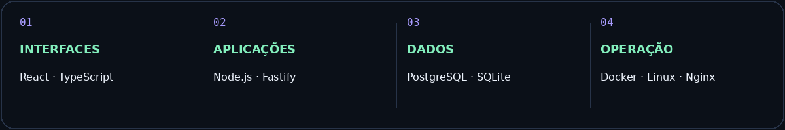

  

  <strong>Desenvolvimento de software com foco em quem usa e em quem mantém.</strong> 
  Aplicações web, automação de processos e infraestrutura de TI.

  <a href="https://chenetdesenvolvimento.com.br"><strong>Conheça a Chenet Desenvolvimento ↗</strong></a>

---

### Do processo ao produto

Sou Gabriel Chenet. Atuo com desenvolvimento de sistemas e infraestrutura de TI, transformando necessidades operacionais em ferramentas para o dia a dia das empresas.

Meu trabalho conecta interfaces, APIs, bancos de dados e ambientes de produção, com foco em gestão empresarial, logística e automação.

### Áreas de atuação

<table>
  <tr>
    <td width="50%" valign="top">
      <h3>01 / Sistemas web</h3>
      
Portais administrativos, áreas do cliente e ferramentas que organizam a operação.

      
<code>React</code> <code>TypeScript</code> <code>Node.js</code>

    </td>
    <td width="50%" valign="top">
      <h3>02 / Integrações e automação</h3>
      
APIs e fluxos que conectam sistemas, centralizam informações e reduzem tarefas manuais.

      
<code>APIs REST</code> <code>Fastify</code> <code>PowerShell</code>

    </td>
  </tr>
  <tr>
    <td width="50%" valign="top">
      <h3>03 / Gestão e logística</h3>
      
Ferramentas para acompanhamento de transportes, rotinas operacionais e indicadores.

      
<code>Gestão operacional</code> <code>Dashboards</code>

    </td>
    <td width="50%" valign="top">
      <h3>04 / Infraestrutura</h3>
      
Implantação de aplicações, administração de servidores e suporte à continuidade da operação.

      
<code>Docker</code> <code>Linux</code> <code>Nginx</code>

    </td>
  </tr>
</table>

### Tecnologias que conectam as entregas

### Projetos e frentes de desenvolvimento

| Frente | Foco do trabalho |
| :--- | :--- |
| **Chenet Desenvolvimento** | Site institucional, área do cliente e gestão de projetos e atendimento. |
| **Sistemas para transportes** | Gestão operacional, acompanhamento de viagens e rotinas administrativas. |
| **Aplicações desktop** | Ferramentas com integração de serviços e armazenamento local. |
| **Painéis de indicadores** | Visualização de informações para acompanhamento e tomada de decisão. |

### Da ideia à operação

**Entender o processo → Organizar a solução → Desenvolver → Implantar → Evoluir**

Trabalho por etapas, considerando usabilidade, controle de acesso, manutenção e as necessidades reais de cada operação.

---

  <strong>Tem um processo que precisa virar sistema?</strong>  
  <a href="https://chenetdesenvolvimento.com.br">Vamos conversar pela Chenet Desenvolvimento ↗</a>

