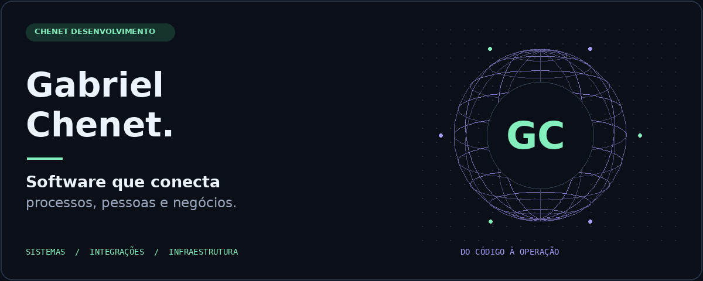
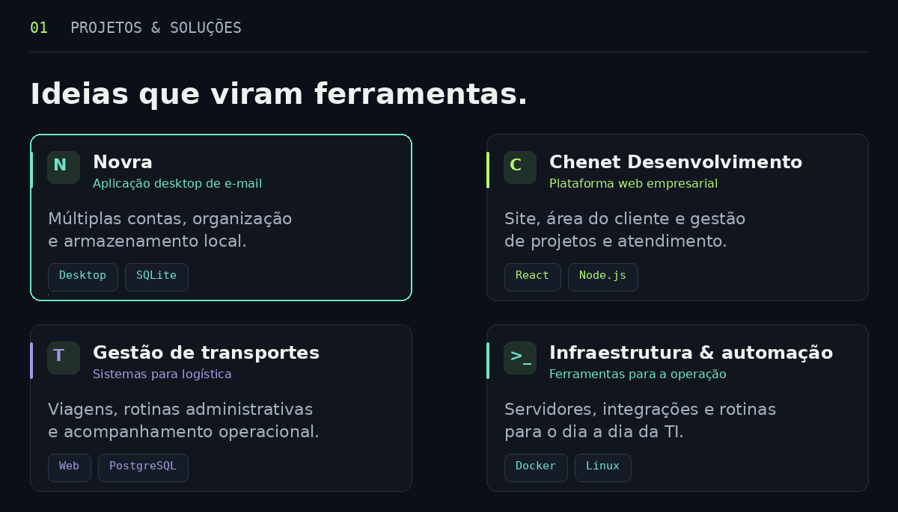
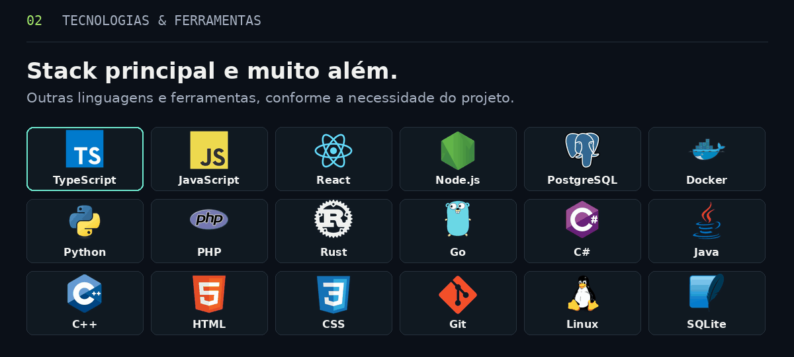
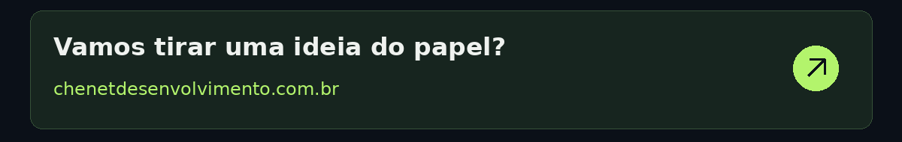

  

  Desenvolvo sistemas e conecto tecnologia à rotina das empresas. 
  <strong>Atuação em múltiplas linguagens, com a tecnologia adequada a cada projeto.</strong>

  <a href="https://chenetdesenvolvimento.com.br">Site & contato ↗</a>

<strong>Mais sobre meu trabalho e tecnologias</strong>

Atuo com desenvolvimento de software e infraestrutura de TI, conectando necessidades operacionais a soluções digitais. Meu trabalho envolve interfaces, APIs, bancos de dados, implantação e evolução de aplicações.

- **Novra:** aplicação desktop de e-mail com múltiplas contas e armazenamento local.
- **Chenet Desenvolvimento:** site institucional, área do cliente e gestão de projetos e atendimento.
- **Gestão de transportes:** ferramentas para viagens, rotinas administrativas e acompanhamento operacional.
- **Infraestrutura e automação:** servidores, integrações e ferramentas de apoio à operação de TI.

**Stack principal:** JavaScript, TypeScript, React, Node.js, Fastify, PostgreSQL e Docker.

**Outras linguagens e ferramentas:** Python, PHP, Rust, Go, C#, Java, C++, HTML, CSS, SQLite, Git, Linux, Nginx e PowerShell, entre outras, conforme as necessidades do projeto. As tecnologias destacadas não limitam minha atuação.

  

